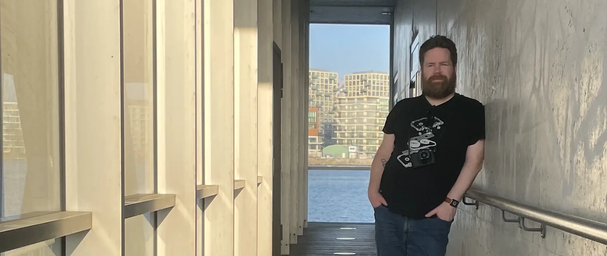

# About me

Hi there! My name is **Kevin Renskers**, and I'm a creative product-minded software developer with a passion for good usability and great design. I love working on intuitive, user-friendly interfaces and the APIs behind them.

I created my first website in 2000, and got my first job as a PHP developer in 2001. In 2009 I switched to **Python** and **Django**, and in 2010 I created my first **iOS** app. I've been a fully remote freelance software developer since 2016, working for international clients such as CBS, Last.fm, Sentry, WeTransfer, Unilever, and Emmy and Oscar winner Sound Radix. In 2023 I shifted my focus from mostly iOS work back to the open web.

My hobbies and interests include playing PC games, playing Dungeons & Dragons, watching tv shows (a list of my all-time favs can be [found on IMDB](https://www.imdb.com/list/ls047084150/)), cooking, [photography](https://glass.photo/kevinrenskers) and architecture.

Some of my all-time favorites PC games include The Last of Us, Lies of P, Uncharted, Crusader Kings III, Europa Universalis IV, Cyberpunk 2077, Elden Ring, Baldur's Gate 3, Divinity: Original Sin 2, Horizon Zero Dawn, God of War, Brotato, Rainbow Six Vegas, Titanfall 2, Dishonored, Hades, No Rest for the Wicked, and No One Lives Forever.

I built [Critical Notes](https://www.critical-notes.com), I maintain a bunch of [open source projects](/projects/), and I'm a member of the [Django Software Foundation](https://www.djangoproject.com/foundation/).

I choose cats over dogs, tea over coffee, and winter over summer. I've lived in Iceland for almost four years, and my favorite foods are ramen, hamburgers, tacos, and Thai.

You can reach me at <kevin@loopwerk.io>, [LinkedIn](https://www.linkedin.com/in/kevinrenskers/), and on [Mastodon](https://hachyderm.io/@kevinrenskers).

