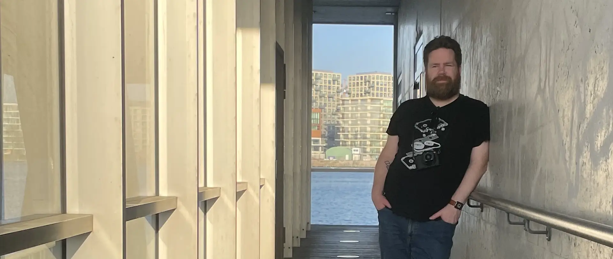

# About me

Hi there! My name is **Kevin Renskers**, and I'm a product-minded engineering lead with a passion for good usability and great design. Over 25 years I've grown from writing code to owning products end to end: the user problem, the UX, the architecture, and the team building it. I care most about shipping software that people genuinely enjoy using, and that still makes sense a year later.

I created my first website in 2000, and got my first job as a PHP developer in 2001. In 2009 I switched to **Python** and **Django**, and in 2010 I created my first **iOS** app. I've worked as a fully remote developer since 2016, for international clients such as CBS, Last.fm, Sentry, WeTransfer, Unilever, and Emmy and Oscar winner Sound Radix. In 2023 I shifted my focus from mostly iOS work back to the open web.

My hobbies and interests include playing PC games, playing Dungeons & Dragons, watching tv shows (a list of my all-time favs can be [found on IMDB](https://www.imdb.com/list/ls047084150/)), cooking, [photography](https://glass.photo/kevinrenskers) and architecture.

Some of my all-time favorites PC games include The Last of Us, Lies of P, Uncharted, Europa Universalis IV, Cyberpunk 2077, Elden Ring, Baldur's Gate 3, Brotato, Rainbow Six Las Vegas, Titanfall 2, Dishonored, RimWorld, Hades, Civilization V, and XCOM 2.

I built [Critical Notes](https://www.critical-notes.com), I maintain a bunch of [open source projects](/open-source/), and I'm a member of the [Django Software Foundation](https://www.djangoproject.com/foundation/).

I choose cats over dogs, tea over coffee, and winter over summer. I've lived in Iceland for almost four years, and my favorite foods are ramen, hamburgers, tacos, and Thai.

You can reach me at <kevin@loopwerk.io>, [LinkedIn](https://www.linkedin.com/in/kevinrenskers/), and on [Mastodon](https://hachyderm.io/@kevinrenskers).

